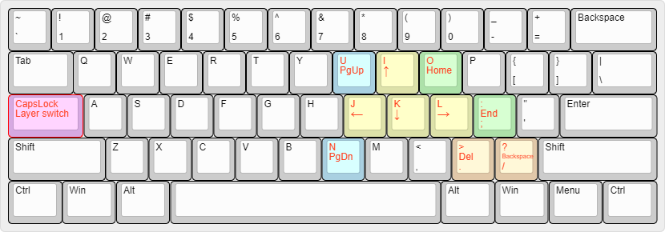

# awesome-keymap
Keymap for productivity (Linux and Windows).

For example, "CapsLock" plus "i", "j", "k", "l" becomes "↑", "←", "↓", "→".

## Default keymap
Use "CapsLock" as the layer switch. Pressing "CapsLock" + "j" becomes "←" as shown in the layout below.

## Installation
### windows
1. Install AutoHotKey (https://autohotkey.com/download/)
2. Clone this repo and execute awesome-keymap/windows/caps2fn.exe
3. Put caps2fn.exe to starup
(https://support.microsoft.com/en-us/help/4026268/windows-change-startup-apps-in-windows-10)

### Linux
